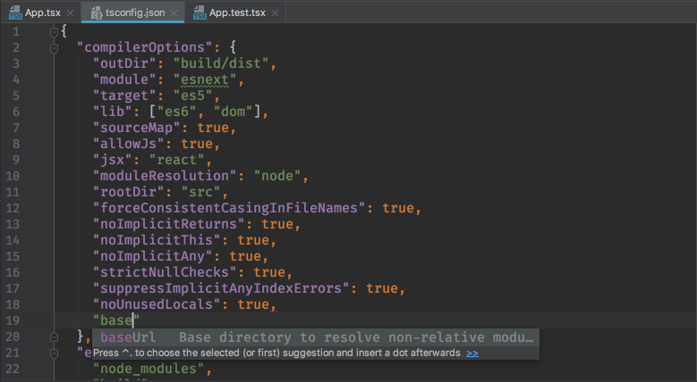
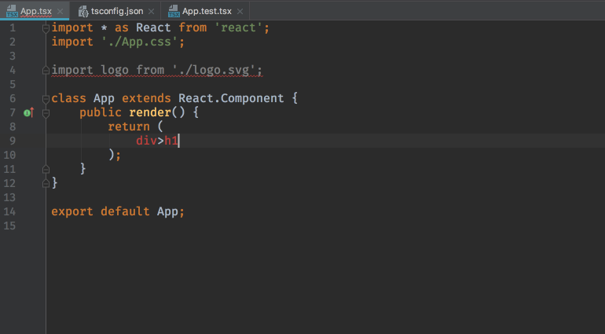
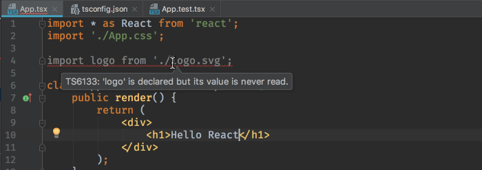
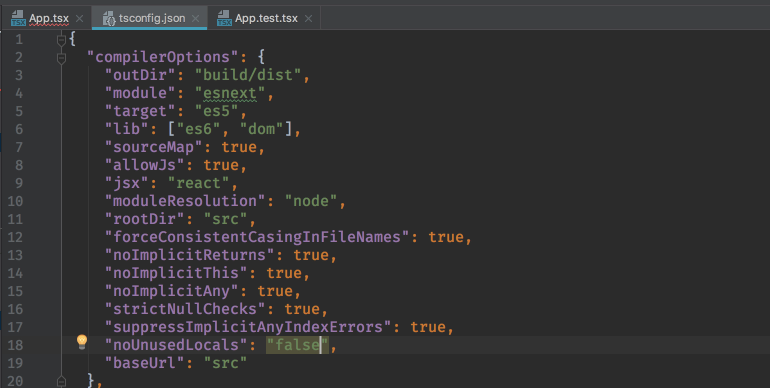
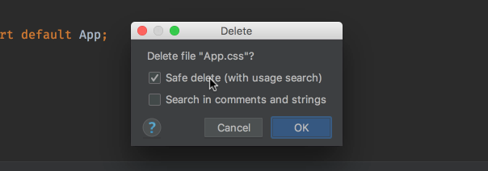

===============
Project Cleanup
===============

In our :doc:`previous step <../project_setup/index>` we generated a project
then took a look around.

We'll use that step as the starting point and do some cleaning up:

- Fix the ``baseUrl`` issue

- Strip out unneeded "Hello World" artifacts to simplify our starting point

- Correct some TypeScript compilation issues

Along the way we'll show some IDE features in action.

Reformatting Code
=================

We currently have the test runner script running. If you have it running
via ``npm run-script test`` in a terminal window, terminate that process with
``Ctrl-C`` or the equivalent. If you ran it in PyCharm Professional, close
that tool window (and click ``Terminate`` on the dialog.)

In PyCharm Professional, reformatting code is simple. In fact, it's something
you will do constantly. You currently have ``App.test.tsx`` open and it
was complaining about indentation. Do ``Alt-Cmd-L`` (or the equivalent for
``Reformat Code`` on Windows/Linux) and all the indentation will be fixed.

Close that tab and go back to ``App.tsx``. Do the same ``Reformat Code``
operation there as well.

Your Bases Belong To Us
=======================

When we do ``npm run-script start``, we see a message flash that says::

  Failed to load tsconfig.json: Missing baseUrl in compilerOptions

*Note: it's possible this is fixed by the time you read this.*

This is a TypeScript compiler issue. The version of TypeScript the project
uses expects that value to be set, but ``react-scripts-ts`` doesn't generate
it. Let's fix this and learn about the TypeScript compiler.

Open ``tsconfig.json`` and do a search for ``baseUrl``. As you can see, it's
not there. Add it as a new key at the end of ``compilerOptions``::

    "baseUrl": "src"

PyCharm Professional knows the grammar of the file and can autocomplete both
the keys and the values:

In fact, it will generate warnings if you do
something wrong, such as put a number where a string was expected.

Now restart the ``npm run-script start`` in your terminal or in the IDE.
You'll no longer see the error about ``baseUrl``.

Clean Up, Clean Up
==================

Head back to ``App.tsx`` and let's do some steps to make a simpler starting
point for the rest of the series. First, remove all the markup in ``render``
and replace it:

.. code-block:: jsx

  public render() {
    return (
        

            <h1>Hello React</h1>
        

    );
  }

In PyCharm Professional you can quickly generate markup using
*Emmet*. Highlight the markup to replace and enter
``div>h1<enter>Hello React``:

We have a TypeScript compiler error::

  Error:(4, 1) TS6133: 'logo' is declared but its value is never read.

If we hover over the red squiggly on line 4 in the IDE, it shows the error
message:

We can also see this in PyCharm Professional by clicking on the ``TypeScript``
tool icon.

This error is very informative: not just a specific error message, but the
line number and even the error code (good for googling.) But why is this a
*compiler* error? Shouldn't this be a style error?

The answer: we said so. Open ``tsconfig.json`` again and search for this::

    "noUnusedLocals": true,

If you set that to ``false``, the error goes away. If you set it to a
non-boolean, the IDE warns you:

Set it back to ``true`` and instead, delete the line. When you save, the
error no longer appears.

While you're at it:

- Delete the ``import './App.css';`` line

- Delete the ``logo.svg`` and ``App.css`` files

In PyCharm, when you do a delete, you're actually doing a "Safe Delete", with
the option to look for places in the project where you might have used it.
Give it a try by starting the delete process on ``index.css``. The IDE will
warn you:

More IDE Goodies
================

We're talking about cleanup. Let's look at some ways PyCharm Professional
can help us on this.

Let's say were in a file and were writing something like ``class App`` and
hadn't imported React yet. Plus, with TypeScript, the import has to be a
certain way.

Simulate this by deleting the line:

.. code-block:: typescript

  import * as React from 'react';

The IDE tells you about the error, with a red squiggly on the usage of
``React``.

.. image:: screenshots/missing_import.png
    :width: 770px
    :alt: Get warnings on missing imports

Click on it, then ``Alt-Enter`` and choose ``Add Import Statement``. PyCharm
generates the proper import:

.. image:: screenshots/add_import.png
    :width: 480px
    :alt: Let the IDE generate missing imports

Let's say I wanted to rename ``App``. Where is it being used? Right-click
on it, then choose ``Find Usages``. A window pops up. Turns out it's being
used in a lot of places. Double-click on the usage in ``index.tsx``. PyCharm
opens the file, moves to the line, and puts the cursor in the right spot.

How about the other direction...you're sitting on the usage and want to go
to the definition? Use ``Cmd-B`` to jump to the class that defines ``App``.

I could now start the process of renaming by visiting all the usages. Bleh.
Can't I let the IDE do it for me? Click on ``App`` in ``class App`` and hit
``Ctrl-T``, then choose ``Rename`` to Refactor Rename the class to ``MyApp``:

.. image:: screenshots/refactor_rename.png
    :width: 530px
    :alt: Let the IDE rename symbols in all usages

In the tool window showing you the consequences, choose ``Do Refactor``.

Oh no, that's not what I wanted! Do I have to do another refactor? Nope. The
IDE did all those operations in one editor transaction. Just use Undo and
say ``Ok`` on the dialog.

Conclusion
=========-

TODO

- baseUrl doesn't seem to cause an issue any more with latest TS (confirm)

- Instead of silencing the error, teach them to respect the error

-